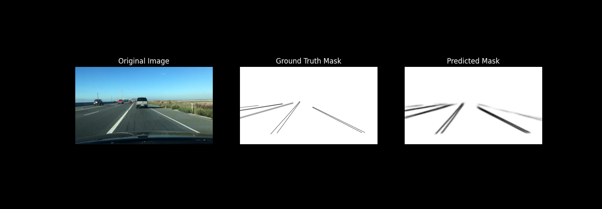

# 🚗 Real-Time Lane & Vehicle Detection using UNet and YOLOv8
A real-time lane and vehicle detection system using UNet for semantic segmentation and YOLOv8 for object detection.
- 🧠 Semantic Segmentation (UNet)
- 🎯 Object Detection (YOLOv8)

---

## 🧠 Technologies Used

| Area              | Technology                         |
|-------------------|-------------------------------------|
| Computer Vision    | OpenCV, PIL, torchvision            |
| Deep Learning      | PyTorch, YOLOv8, UNet               |
| Robotics Concepts  | Perception, Control (PID), Navigation |
| Deployment         | Streamlit, Git                     |

---

## 🧩 Architecture

- **UNet** for semantic segmentation of road lanes  
- **YOLOv8** for vehicle and object detection  
- **Streamlit Dashboard** for real-time image/video inference

---

## 📁 Folder Structure

```bash
├── data/
│   └── bdd100k/ (dataset)
├── model/
│   └── best_unet_model.pth (not uploaded to GitHub due to size)
├── outputs/
│   └── output_lane_detected.mp4
│   └── Streamlit_output.png
├── scripts/
│   ├── train.py
│   ├── model.py
│   ├── eval_lane.py
│   ├── convert_json_to_mask.py
│   ├── interpolate_mask_moving_avg.py
│   ├── inference.py
│   ├── lane_streamlit.py
│   └── yolo_integrated.py
├── LICENSE
├── README.md
├── results.txt
└── yolov8n.pt

---

## 📊 Results

Validation Loss      : 0.0511
Validation Accuracy  : 98.19%
Validation F1 Score  : 0.4319
Jaccard Index (IoU)  : 0.2767

---

## 🚗 Outputs

### Lane + YOLO Detection (Image)
<<<<<<< HEAD


=======


>>>>>>> 9a5c13d (Updated output files after refactor)

### Inference Output




---

## 🚀 How to Use Locally

```bash
# 1. Clone the repo
git clone https://github.com/Nishit2608/Real-Time_Lane_and_Vehicle_Detection_using_UNet_and_YOLOv8.git
cd Real-Time_Lane_and_Vehicle_Detection_using_UNet_and_YOLOv8

# 2. Install dependencies
pip install -r requirements.txt

# 3. Run inference
python scripts/yolo_integrated.py

---

## 📦 Dataset
The project utilizes the BDD100K dataset, a large-scale driving video dataset containing diverse scenes across day/night and various weather conditions. Specifically:
Semantic Lane Segmentation: Used UNet for training on lane masks derived from labeled lane annotations.
Vehicle Detection: Leveraged YOLOv8 with BDD100K object annotations for bounding box detection of cars, trucks, and motorcycles.

## 📥 Pretrained Model (UNet)
You can download the trained UNet model (20 epochs) from:

🔗 [Download best_unet_model.pth](https://drive.google.com/file/d/1scOirAZLDRpGhGUSyQozREkejprI7BYg/view?usp=sharing)

Place it in the `model/` directory before running inference.


