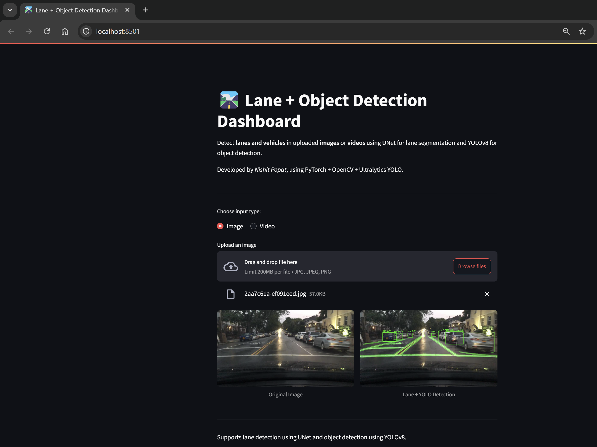

# 🚗 Real-Time Lane & Vehicle Detection using UNet and YOLOv8

  

Welcome to the **Real-Time Lane & Vehicle Detection** project! This repository demonstrates a fusion of **deep learning model training**, **semantic segmentation** and **object detection** using deep learning models in a simulated environment. It highlights robust lane detection and vehicle recognition using UNet and YOLOv8, with real-time visualization via Streamlit. 🚀

## 📚 Table of Contents

- [🚗 Project Overview](#-real-time-lane--vehicle-detection-using-unet-and-yolov8)
- [📌 Introduction](#-Introduction)
- [🧠 Technologies Used](#-technologies-used)
- [🧩 Architecture](#-architecture)
- [📁 Folder Structure](#-folder-structure)
- [📊 Results](#-results)
- [🚦 Outputs](#-Outputs)
- [🚀 How to Use Locally](#-how-to-use-locally)
- [📦 Dataset](#-dataset)
- [📥 Pretrained Model (UNet)](#-pretrained-model-unet)
- [📄 License](#-license)
  
---

## Introduction
A real-time lane and vehicle detection system using UNet for semantic segmentation and YOLOv8 for object detection.
- 🧠 Semantic Segmentation (UNet)
- 🎯 Object Detection (YOLOv8)

## 🧠 Technologies Used

| Area              | Technology                         |
|-------------------|-------------------------------------|
| Computer Vision    | OpenCV, PIL, torchvision            |
| Deep Learning      | PyTorch, YOLOv8, UNet               |
| Robotics Concepts  | Perception, Control (PID), Navigation |
| Deployment         | Streamlit, Git                     |

---

## 🧩 Architecture

- **UNet** for semantic segmentation of road lanes  
- **YOLOv8** for vehicle and object detection  
- **Streamlit Dashboard** for real-time image/video inference

---

## 📁 Folder Structure

├── data/
│   └── bdd100k/ (dataset)
├── model/
│   └── best_unet_model.pth (not uploaded to GitHub due to size)
├── outputs/
│   └── output_lane_detected.gif
│   └── Streamlit_output.png
|   └── interpolated_output.gif
├── scripts/
│   ├── train.py
│   ├── model.py
│   ├── eval_lane.py
│   ├── convert_json_to_mask.py
│   ├── interpolate_mask_moving_avg.py
│   ├── inference.py
│   ├── lane_streamlit.py
│   └── yolo_integrated.py
├── LICENSE
├── README.md
├── results.txt
└── yolov8n.pt

--- 

## 📊 Results

Validation Loss      : 0.0511  
Validation Accuracy  : 98.19%  
Validation F1 Score  : 0.4319  
Jaccard Index (IoU)  : 0.2767  

---

## 🚗 Outputs

### 🔹 Lane & Vehicle Detection (GIF Demo)

### 🔹 Alternate Detection View (GIF)

### 🧠 Inference Output (UNet)

### 🎛️ Streamlit Web App

---

## 🚀 How to Use Locally

# 1. Clone the repo
git clone https://github.com/Nishit2608/Real-Time_Lane_and_Vehicle_Detection_using_UNet_and_YOLOv8.git

cd Real-Time_Lane_and_Vehicle_Detection_using_UNet_and_YOLOv8

# 2. Install dependencies
pip install -r requirements.txt

# 3. Run inference
python scripts/yolo_integrated.py

---

## 📦 Dataset
The project utilizes the BDD100K dataset, a large-scale driving video dataset containing diverse scenes across day/night and various weather conditions. Specifically:
Semantic Lane Segmentation: Used UNet for training on lane masks derived from labeled lane annotations.
Vehicle Detection: Leveraged YOLOv8 with BDD100K object annotations for bounding box detection of cars, trucks, and motorcycles.

---

## 📥 Pretrained Model (UNet)
You can download the trained UNet model (20 epochs) from:

🔗 [Download best_unet_model.pth](https://drive.google.com/file/d/1scOirAZLDRpGhGUSyQozREkejprI7BYg/view?usp=sharing)

Place it in the `model/` directory before running inference.

---

## 📄 License

This project is licensed under the **MIT License**.  
See the [LICENSE](LICENSE) file for details.

---

